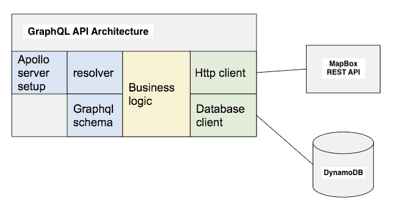

# Serverless GraphQL Example API

This project serves as a template to create a **Serverless GraphQL API** using **Node.js Apollo Server** and deployed on **AWS Lambda + API Gateway** using **Terraform**.

Currently it supports two entities, `User` and `Coords`, and several GraphQL queries and mutations.

GraphQL server uses the [Apollo Server Framework](https://www.npmjs.com/package/apollo-server) and the [Apollo Server Lambda](https://www.npmjs.com/package/apollo-server-lambda) package.



Although this project was created with AWS Lambda in mind, the code is moduled in a way that it's very easily converted into an `Express` server and deployed in a `Docker` container, for example.

The source code of the project and how it's deployed are two separate things. If we deploy it in a Serverless Function or in a Kubernetes Cluster shouldn't impact 99% of the code, and specially the business logic.

With this proposed modularity, it's very easily extended to support more GraphQL entities, queries and mutations.

## Repository Structure

```
- src
  - graphql
    - dataSources   <-- external data source adapters
    - resolvers     <-- queries, mutations and subscriptions
    - schema        <-- graphql api schema definitions
  - server          <-- serverless and local server definitions
- terraform         <-- terraform cloud templates
```

## Live Demo
Deployed API: https://lrnhrii3k3.execute-api.us-east-1.amazonaws.com

Or run locally and access Apollo Studio on `http://localhost:4000`

## GraphQL API Schema
```
type Query {
  # User
  GetUserById(id: ID!): User!
  ListUsers(cursor: String, limit: Int, filter: String): UserList!

  # Coords
  GetCoordsByAddress(address: String): Coords!
}

type Mutation {
  CreateUser(input: CreateUserInput!): User!
  UpdateUser(input: UpdateUserInput!): User!
  DeleteUser(id: ID!): String!
}

type User {
  id: ID!
  name: String!
  dob: String!
  address: String!
  description: String
  imageUrl: String
  createdAt: String!
  updatedAt: String!
}

type UserList {
  cursor: String
  users: [User]!
}

type Coords {
  lat: Float!
  lon: Float!
}

input CreateUserInput {
  name: String!
  dob: String!
  address: String!
  description: String
  imageUrl: String
}

input UpdateUserInput {
  id: ID!
  name: String
  dob: String
  address: String
  description: String
  imageUrl: String
}
```

## Postman Collection
We provide a postman collection to easily interact with this API (compatible with Insomnia).

Simply import and configure the `{{url}}` variable in your environment.

## Future Work
 - Add support to Serverless GraphQL Subscriptions
 - Convert the project into a monorepo to help with extensibility
 - Implement a CI/CD strategy using AWS Code Deploy with automatic roolbacks
 - Granular API permissions using AWS Cognito
 - Protect sensitive environment variables, like `MAPBOX_KEY`.

## Development
To run a local development server first configure the `.env` file.


Environment variables:
```
# DynamoDB table name, in production this is set by Terraform
USERS_TABLE=serverless-graphql-example-user-dev

# Mapbox API Key
MAPBOX_KEY=<YOUR_MAPBOX_KEY>

# Enables connection to DynamoDB in http://localhost:8000
IS_LOCAL=true
```

Run command:
```
yarn dev
```

Linting:
```
yarn lint
```

## Build
To build this project and make the package as lean as possible to run in AWS Lambda the build command exports a Serverless Lambda handler highly optimized with only the necessary transpiled JS files needed.
```
yarn build
```

Current package size is 1.5MB zipped and 6.3MB deployed.

For more details check the `dist` folder after `yarn build`.

## Deploy
We provide an Infrastructure as Code Terraform template in the `terraform` folder so that you easily deploy a fully reproducible new environment in AWS.
This template was built using the framework [Serverless.tf](https://serverless.tf).

Make sure to build the deploy package first:
```
yarn build
```

Enter Terraform folder:
```
cd terraform
```

In `main.tf` configure the `MAPBOX_KEY` in the variable `locals.mapbox_api_key`.

Deploy commands:
```
terraform plan -var="stage=<STAGE_NAME>"
terraform apply -var="stage=<STAGE_NAME>"
```

Destroy command:
```
terraform destroy -var="stage=<STAGE_NAME>"
```

## Test
Run jest with coverage report:
```
yarn test
```

For more details, check the `coverage` folder after running `yarn test`.

```
 PASS  src/graphql/resolvers/mutations/deleteUser.unit.test.ts (5.904 s)
 PASS  src/graphql/resolvers/queries/listUsers.unit.test.ts (5.914 s)
 PASS  src/graphql/resolvers/mutations/updateUser.unit.test.ts (6.043 s)
 PASS  src/graphql/resolvers/mutations/createUser.unit.test.ts (6.064 s)
 PASS  src/graphql/resolvers/queries/getCoordsByAddress.unit.test.ts (6.084 s)
 PASS  src/graphql/resolvers/queries/getUserById.unit.test.ts (6.225 s)
 PASS  src/tests/integration/coords.test.ts (6.474 s)
 PASS  src/tests/integration/user.test.ts (6.615 s)
------------------------------------------------------------|---------|----------|---------|---------|-------------------
File                                                        | % Stmts | % Branch | % Funcs | % Lines | Uncovered Line #s
------------------------------------------------------------|---------|----------|---------|---------|-------------------
All files                                                   |     100 |    90.91 |     100 |     100 |
 serverless-graphql-example                                 |     100 |      100 |     100 |     100 |
  jest-dynalite-config.js                                   |     100 |      100 |     100 |     100 |
 serverless-graphql-example/src                             |     100 |      100 |     100 |     100 |
  dynamodb.ts                                               |     100 |      100 |     100 |     100 |
 serverless-graphql-example/src/graphql/dataSources         |     100 |    88.24 |     100 |     100 |
  coords.ts                                                 |     100 |      100 |     100 |     100 |
  index.ts                                                  |     100 |      100 |     100 |     100 |
  user.ts                                                   |     100 |    83.33 |     100 |     100 | 6,43,83-87
 serverless-graphql-example/src/graphql/resolvers           |     100 |      100 |     100 |     100 |
  index.ts                                                  |     100 |      100 |     100 |     100 |
 serverless-graphql-example/src/graphql/resolvers/errors    |     100 |      100 |     100 |     100 |
  index.ts                                                  |     100 |      100 |     100 |     100 |
 serverless-graphql-example/src/graphql/resolvers/mutations |     100 |      100 |     100 |     100 |
  createUser.ts                                             |     100 |      100 |     100 |     100 |
  deleteUser.ts                                             |     100 |      100 |     100 |     100 |
  index.ts                                                  |     100 |      100 |     100 |     100 |
  updateUser.ts                                             |     100 |      100 |     100 |     100 |
 serverless-graphql-example/src/graphql/resolvers/queries   |     100 |      100 |     100 |     100 |
  getCoordsByAddress.ts                                     |     100 |      100 |     100 |     100 |
  getUserById.ts                                            |     100 |      100 |     100 |     100 |
  index.ts                                                  |     100 |      100 |     100 |     100 |
  listUsers.ts                                              |     100 |      100 |     100 |     100 |
 serverless-graphql-example/src/graphql/schema              |     100 |      100 |     100 |     100 |
  index.ts                                                  |     100 |      100 |     100 |     100 |
 serverless-graphql-example/src/graphql/schema/inputs       |     100 |      100 |     100 |     100 |
  CreateUserInput.ts                                        |     100 |      100 |     100 |     100 |
  UpdateUserInput.ts                                        |     100 |      100 |     100 |     100 |
 serverless-graphql-example/src/graphql/schema/objects      |     100 |      100 |     100 |     100 |
  Coords.ts                                                 |     100 |      100 |     100 |     100 |
  User.ts                                                   |     100 |      100 |     100 |     100 |
 serverless-graphql-example/src/graphql/schema/root         |     100 |      100 |     100 |     100 |
  Mutation.ts                                               |     100 |      100 |     100 |     100 |
  Query.ts                                                  |     100 |      100 |     100 |     100 |
 serverless-graphql-example/src/server                      |     100 |      100 |     100 |     100 |
  config.ts                                                 |     100 |      100 |     100 |     100 |
 serverless-graphql-example/src/tests/mocks                 |     100 |      100 |     100 |     100 |
  coords.ts                                                 |     100 |      100 |     100 |     100 |
  user.ts                                                   |     100 |      100 |     100 |     100 |
------------------------------------------------------------|---------|----------|---------|---------|-------------------

Test Suites: 8 passed, 8 total
Tests:       17 passed, 17 total
Snapshots:   0 total
Time:        7.172 s
Ran all test suites.
✨  Done in 7.82s.
```
